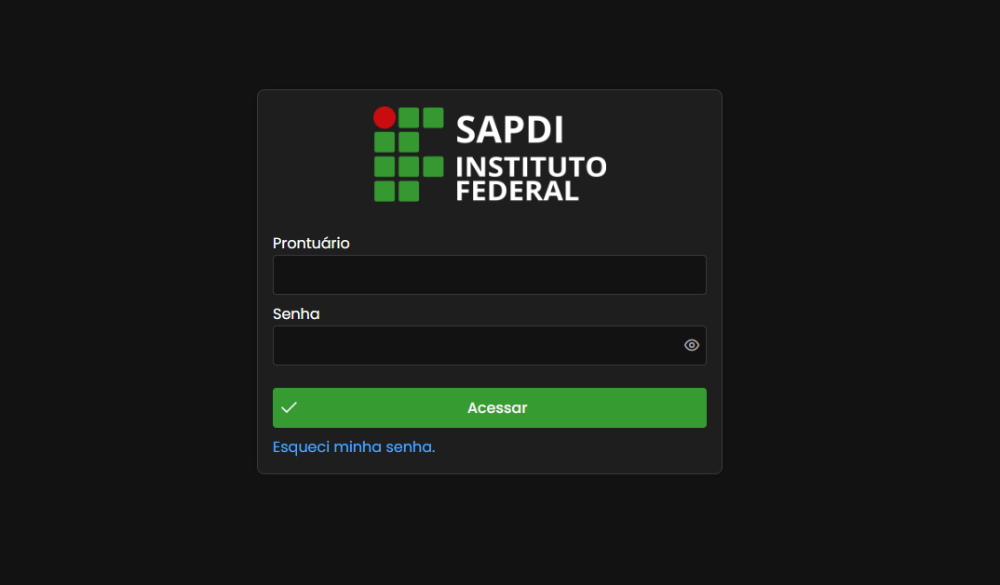
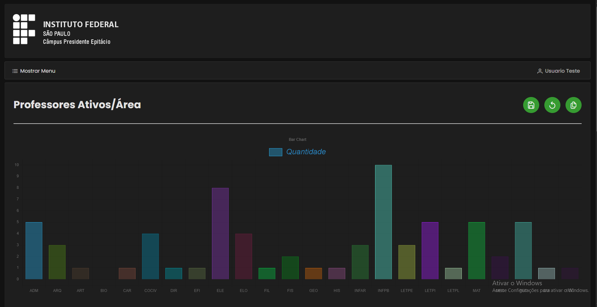
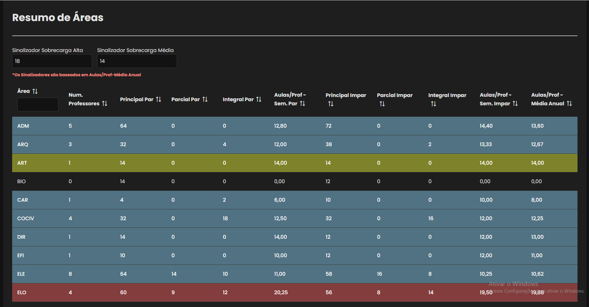

# Sistema de Gerenciamento do Plano de Desenvolvimento Institucional (PDI)

Este sistema foi desenvolvido em equipe conforme demanda para simular possíveis cenários de desenvolvimento institucional e quais seriam os seus impactos no câmpus do IFSP - Presidente Epitácio.

É possível conferir toda a documentação do sistema no diretório `Documentação`.

O código fonte do sistema pode ser acessado no diretório `Codigo_Fonte`.

Dentro do diretório `Scripts` está contido alguns scripts de inserções em banco de dados, além de scripts que foram realizados para automatizar alguns processos manuais da equipe.

O sistema permanece em produção para futuras manutenções, link de acesso:

`http://pep2.ifsp.edu.br/sapdi/`

## Stack

**Tecnologias:** Java, JDK 11, JSF 2.3, Primefaces 12.0, MySQL, Payara Server, Glassfish Server e Docker.

## Screenshots

 Todo o sistema é responsivo para dispositivo móveis. 

<strong>>> Todos os dados utilizados para realizar as screenshots são simulados <<<</strong>

<strong>É possível visualizar algumas telas do sistema a seguir</strong>

### **Página de Login**

### **Página de Home do Usuário (1)**

### **Página de Home do Usuário (2)**

